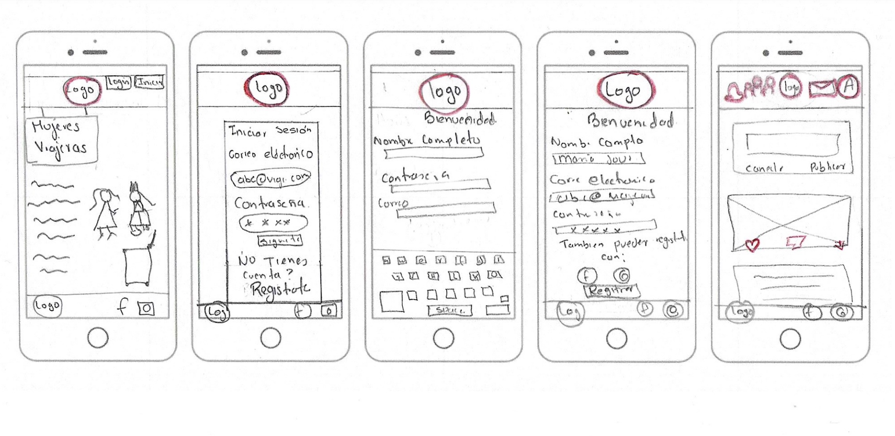

# Creando una Red Social

## Prototipo de baja fidelidad

.

.

## Diagrama de Flujo

![Diagrama de Flujo]
(ImagenesReadme/social-network.png) 

## Autenticacion en firebase 
.
autenticationFirebase
