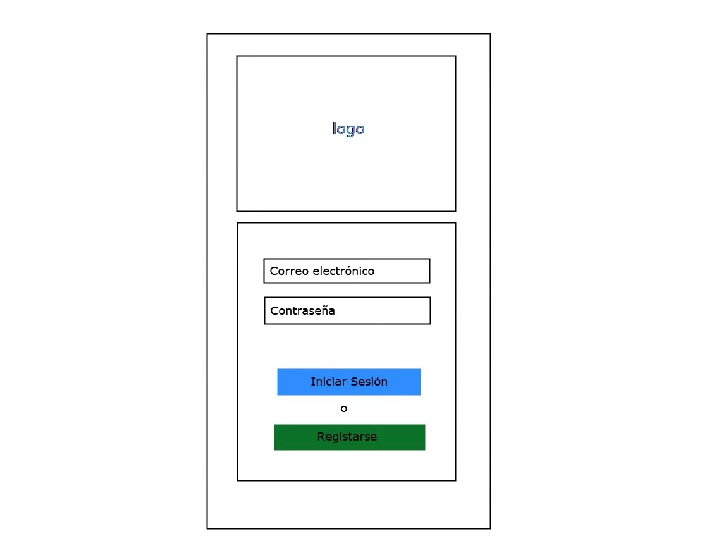
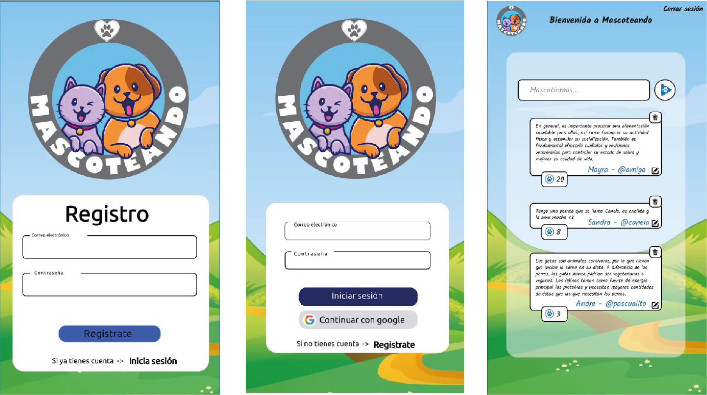
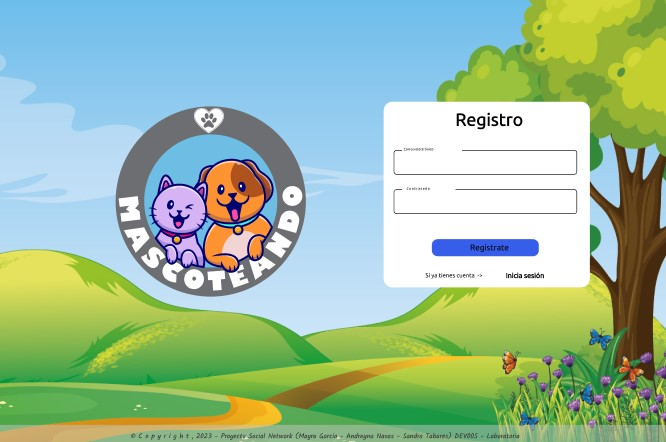
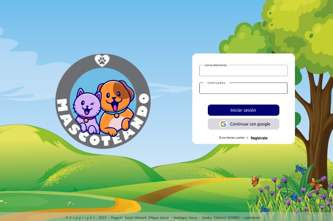
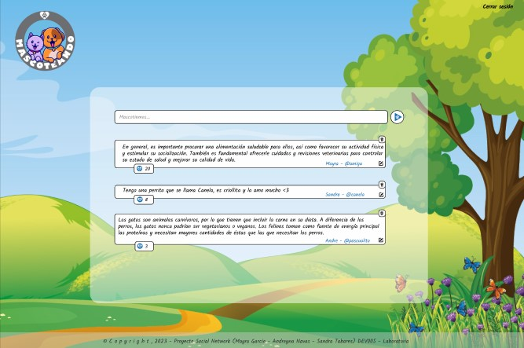
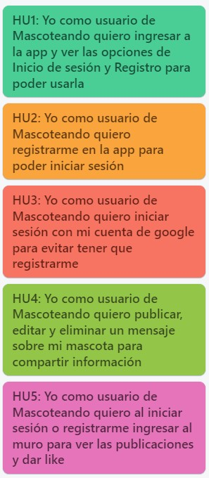
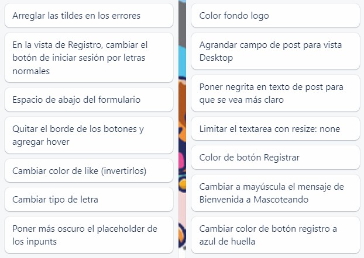

  

## Índice

* [1. Introducción](#1-introducción)
* [2. Prototipos](#2-prototipos)
* [3. Historias de Usuario](#3-historias-de-usuario)
* [4. Usabilidad](#4-usabilidad)
* [5. Url Proyecto](#5-url-proyecto)

## Introducción

Según encuesta realizada por GFK más de la mitad (56%) de la población mundial tiene al menos una mascota en casa; los perros son la mascota más popular en América Latina, mientras que en Europa hay preferencia por los gatos. Así cómo tener un pez como mascota es más popular en China que en cualquier otro de los países donde se realizó la encuesta: 17% de quienes respondieron en línea dijeron tener uno.

En Mascoteando se pretende reunir una comunidad de amantes a las Mascotas en la cual son bienvenidas las personas de cada rincón del mundo y pueden interactuar hablando sobre sus mascotas, salud, diversión, cuidados, tips, entre otros.

## Prototipos

### Baja Fidelidad

  

### Alta Fidelidad
- Vista Móvil Login

- Vista Desktop Register

- Vista Desktop Login

- Vista Desktop Home

## Historias de Usuario

Para las historias de usuarios se utilizó Trello como metodo de organización, cada sprint se planeaba una nueva historia  en base a los requerimientos y desarrollo del Proyecto. 

  

## Test de usabilidad

A lo largo del Proyecto se realizaron test de usabilidad con usuarios amantes de las mascotas, teniendo cómo feedback las siguientes mejoras:

  

## Url Proyecto
| Despliegue | URL |
| ------ | ------ |
| Vercel | https://mascoteando-andrenavas.vercel.app/ |

