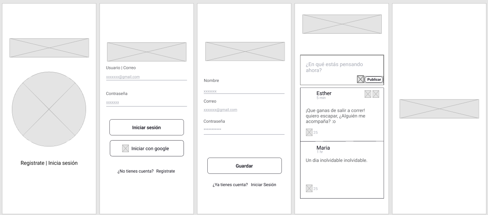

=======
# Red Social

## Índice

-   [1. Resumen del proyecto](#1-resumen-del-proyecto)
-   [2. Herramientas usadas en el proyecto](#2-Herramientas-usadas-en-el-proyecto)
-   [3. Historias de usuario](#3-historias-de-usuario)
-   [4. Prototipado](#4-prototipado)
-   [5. Vistas](#5-vistas)

## 1. Resumen del proyecto

`SportX` es una red social creada para los amantes de los deportes. Su objetivo es permitir a los usuarios compartir sus deportes favoritos, formar una comunidad y organizar eventos deportivos. Además, esta plataforma facilita el intercambio de información relevante sobre deportes. `SportX` ofrece una experiencia fluida y agradable al permitir que los usuarios publiquen, editen y reaccionen a la información compartida sobre deportes. De esta manera, la plataforma se convierte en un espacio dinámico para descubrir y conectarse con otros aficionados.

## 2. Herramientas usadas en el proyecto

```sh
-   HTML
-   CSS
-   JavaScript
-   Firebase
-   Git y Github
```

## 3. Historias de usuario:


## 4. Prototipado

```sh
 - Prototipo de baja fidelidad
```



```sh
- Prototipo de alta fidelidad

```


## 5. Vistas

```sh
- Version desktop

```


```sh
- Version mobile

```

<<<<<<< HEAD

>>>>>>> d84a69af10a15b350b72ea194c94ba6f6255a55f
=======

>>>>>>> d05dd67f1489c6ce5b1268a41ba086a89c91f7a5
